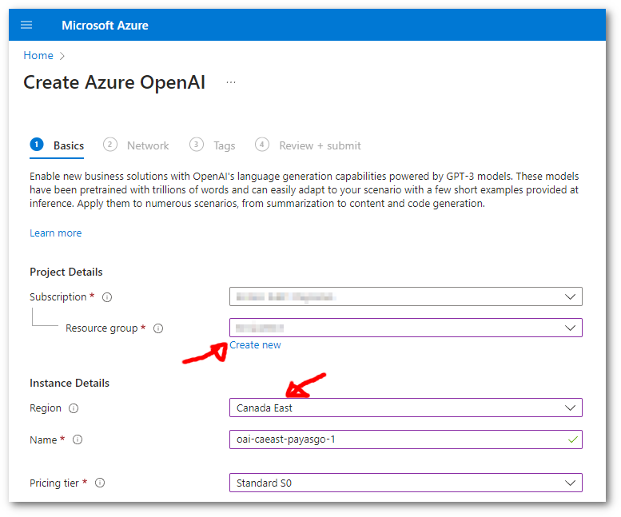

# Azure OpenAI Service Configuration with `big-AGI`

The following procedure will take ~5 minutes to go from zero to an Azure account with
access to the Azure OpenAI service, allocate instances, and deploy models.

By default the pricing is 'pay-as-you-go', and you enter credit card information which
is tied to a 'subscription' to the Azure service.

## Setup big-AGI

Once you have API Endpoint and API Key it's easy to configure big-AGI.

1. Open the big-AGI application
2. Go to the **Models** settings
3. Add a Vendor, and select **Azure OpenAI**
    - input the Endpoint, e.g. 'https://your-openai-api-1234.openai.azure.com/'
    - input the API Key, e.g. 'fd5...........................ba'

The deployed models are now available in the application. If you do not have a configured
Azure OpenAI service instance, read the next section.

## Setup Azure

### Step 1: Azure Account & Subscription

Create your account, and create a subscription (to pay for the service).

1. Create an account on [azure.microsoft.com](https://azure.microsoft.com/en-us/)
2. Navigate to the [Azure Portal](https://portal.azure.com/)
3. Click on **Create a resource** in the top left corner
4. Search for **Subscription** and select **[Create Subscription](https://portal.azure.com/#create/Microsoft.Subscription)**
    - fill in the required fields and click on **create**
    - write down the **Subscription ID** (e.g. `12345678-1234-1234-1234-123456789012`)

### Step 2: Apply for Azure OpenAI Service

We'll now be creating "OpenAI"-specific resources on Azure. This requires to 'apply',
and acceptance should be quick (even as low as minutes)

1. Go to [Azure OpenAI Service](https://aka.ms/azure-openai)
2. Click on **Apply for access**
    - Fill in the required fields (including the subscription ID) and click on **Apply**

Once accepted you can now create OpenAI resources on Azure

### Step 3: Azure OpenAI Resource

For more help, see [Azure: Create and deploy OpenAI](https://learn.microsoft.com/en-us/azure/ai-services/openai/how-to/create-resource?pivots=web-portal)

1. Click on **Create a resource** in the top left corner
2. Search for **OpenAI** and select **[Create OpenAI](https://portal.azure.com/#create/Microsoft.CognitiveServicesOpenAI)**
3. This will take you to the **Create OpenAI** page
   
    - Select the subscription
    - Select the a resource group, or quickly create one from this page
    - Select the region:
   > Note: The region is important, as it will determine the models available to you. **Canada East** has GPT-4-32k models, for instance.
   > For the full list, see [Azure > OpenAI > Models > GPT-4 models](https://learn.microsoft.com/en-us/azure/ai-services/openai/concepts/models)
    - Select a name for the service (e.g. `your-openai-api-1234`)
    - Select a pricing tier (e.g. `S0` is standard)
    - Select: "All networks, including the internet, can access this resource."
    - Click on **Review + create** and then **Create** (no need to configure anything else)

API Keys and Endpoints are available after resource creation

1. Click on **Go to resource**
2. Click on **Develop**
    - Copy the _Endpoint_, under "Language API", e.g. 'https://your-openai-api-1234.openai.azure.com/'
    - Copy the _KEY 1_

### Step 4: Deploy Models

In the OpenAI resource instance, models are not available by default. You need to pick and
choose using an operation called "deploy" (which doesn't seem related to devops deployments,
as it is instant).

1. Click on **Model Deployments > Manage Deployments**
2. Click on **+Create New Deployment** for how many models you want to make available
   
3. Select the model you want to deploy

## See Also

- [Azure OpenAI Service Documentation](https://learn.microsoft.com/en-us/azure/ai-services/openai/)
- [Guide: Create an Azure OpenAI Resource](https://learn.microsoft.com/en-us/azure/ai-services/openai/how-to/create-resource?pivots=web-portal)
- [Azure OpenAI Models](https://learn.microsoft.com/en-us/azure/ai-services/openai/concepts/models)
